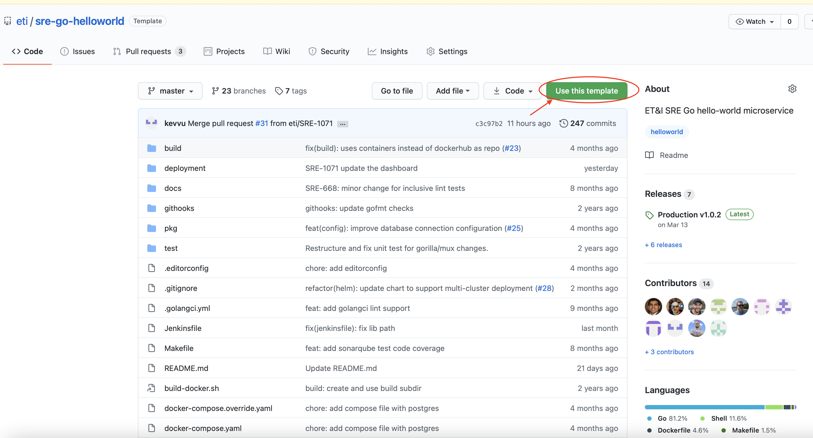
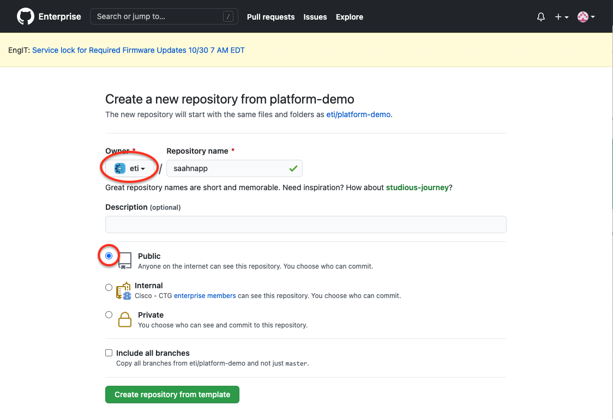

# ETI sre-go-helloworld

- Jenkins: [](https://engci-private-sjc.cisco.com/jenkins/eti-sre/job/SRE/job/Projects/job/sre-go-helloworld/job/build/job/sre-go-helloworld/job/main/)
- ArgoCD: [](https://argocd.prod.eticloud.io/applications/blue-b-sre-go-helloworld-app-dev-argoapp?resource=)


This is a "boilerplate" go microservice with following example showcase  features:

- CI/CD Setup
- Config Management
- Secrets Management
- Database Access
- Go Private Modules
- sre-go-logger
- idpadapter
## Quick Start

## How to use sre-go-helloworld as a template

1. Create a new repo from the template [sre-go-helloworld](https://wwwin-github.cisco.com/eti/sre-go-helloworld) repo by clicking on the `Use this template` button on the upper right.
    
    * Select `eti` as the Owner and choose a short unique name for the repo (e.g., `<CEC_ID>app`). This repo name will be used as the default name for your new application.
    * Select `Public` visibility
    
1. Clone the new repo to your local development environment.
    ```
    git clone git@wwwin-github.cisco.com:eti/<YOUR_APP_NAME>.git
    ```
1. `cd` into the repo and run the `runme.sh` to reconfigure the repo for your new application.
    ```shell
    ./runme.sh
    ```
1. The previous step should have created a new branch (named `<your app name>-<random string>`). Create a PR from that branch and merge it.
1. Reach out to SRE team in the [**Ask ET&I SRE**](https://eurl.io/#e7SKpvpKj) space to request a fully automated CI/CD pipeline for your new application

After the SRE creates the CI/CD pipeline and deploys your application, you can navigate to `https://<YOUR_APP_NAME>.int.dev.eticloud.io/` to see your deployed application.


See the [Troubleshooting](docs/troubleshooting.md) page if you run into any issues.

## sre-go-helloworld developer setup

### Local Development

[How to retrieve artifactory encrypted password](https://wwwin-github.cisco.com/pages/eti/eti-platform-docs/services/iam/oncall/rotating-generic-users/eti-sre-cicd-gen-encrypted/#step-2-copy-new-encrypted-password-from-artifactory)

```bash
export ARTIFACTORY_USER=<YOUR USERNAME>
export ARTIFACTORY_PASSWORD=<YOUR Encrypted Artifactory Password>
make
```
## Build and Run Docker

```bash
./build-docker.sh

docker run --name postgres -e POSTGRES_DB=helloworld -e POSTGRES_PASSWORD=strongpassword -d postgres
docker run -it -p 5000:5000 -e DB_CONNECTION_INFO=/tmp/dbconfig.json -e DB_NAME=helloworld -v $PWD/build/:/tmp/  --link postgres:postgre sre-go-helloworld
```

## Additional Setup Instructions for Lab VM before build

Skip this step if is not building on Lab VM (i.e. rcdn6-vmXX-YYY).

export DOCKER_BLD_ARGS="https_proxy=http://proxy.esl.cisco.com:80"

Create a credentials file for artifactory in ~/.nyota/credentials with content:

```bash
artifactory_user=yourCECID
artifactory_password=yourPASSWORD
```

and run after:

```bash
chmod 400 ~/.nyota/credentials
```

## Quick links

- [CI Pipeline Jenkins](https://engci-private-sjc.cisco.com/jenkins/eti-sre/job/SRE/job/Projects/job/sre-go-helloworld/job/build/job/sre-go-helloworld/job/main/)

- [CD Pipeline ArgoCD](https://argocd.prod.eticloud.io/applications/sre-go-helloworld-app-dev-projectapp?resource=)

- [Try-out API Swagger UI](https://wwwin-github.cisco.com/pages/eti/sre-go-helloworld)

- [Project layout reference](https://github.com/golang-standards/project-layout)


## Instructions for Developers

### Install git hook to autoformat and run tests

From the main directory, run:

```bash
ln -s $(pwd)/githooks/pre-commit .git/hooks/pre-commit`
```

## Source Code Structure

### /src/pkg

  This will contain the libraries internal to the app

### /docs

  If you need the swag tool, install it using command:

```bash
   go get -u github.com/swaggo/swag/cmd/swag
```

  This contains the rest api specifications in JSON/ yaml. This specifications
  would be used for api documentation. Generated from handler comments using command:

```bash
swag init --parseDependency --parseInternal
```

  Then, if you want to play with the API, run the swagger docker container using:

```bash
docker run --name swagger_ui -p 8080:8080 -d swaggerapi/swagger-ui
```

Open a browser to the swagger UI [http://localhost:8080/](http://localhost:8080/), put http://localhost:5000/docs in the input
field and click on explore button.

### /test

  This contains all the tests and dependent mock functions.

### /deployments

  This contains system and container orchestration, deployment configurations and templates.

### /githooks

  This will have git hooks e.g. go_fmt, staticcheck etc.

### main.go

  This is the main package for the microservice.
